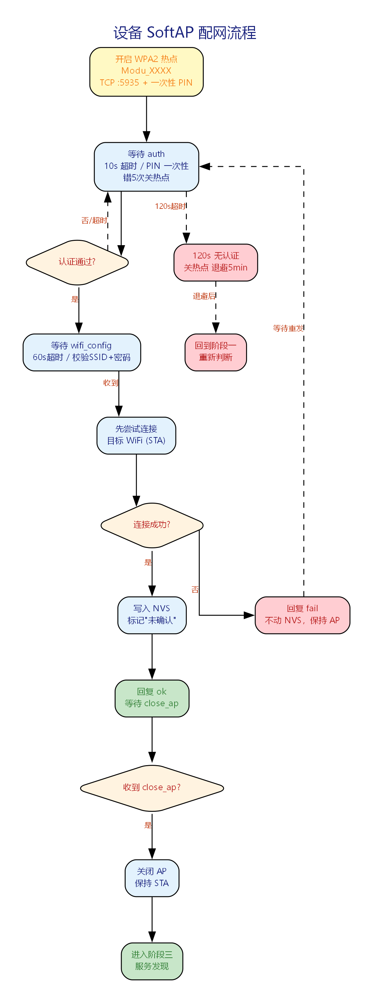
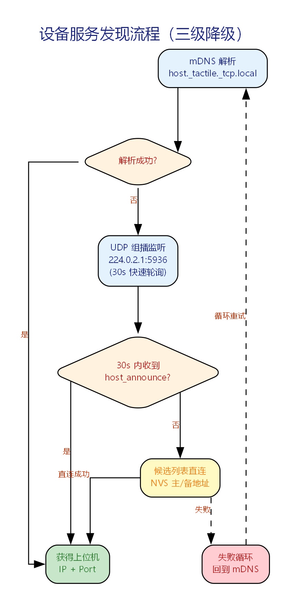
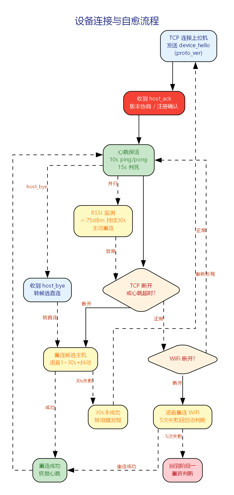
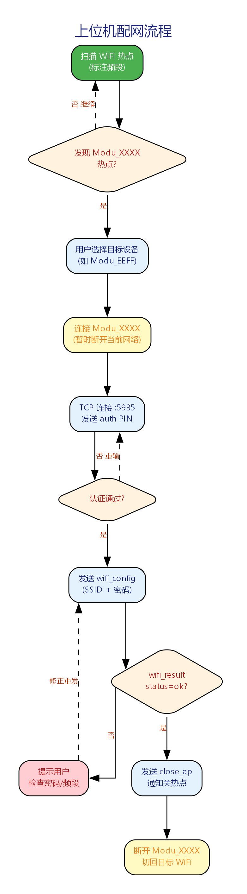
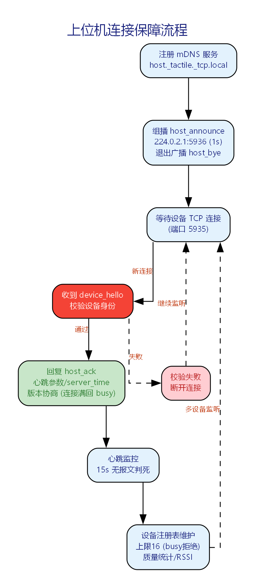

# 配网流程说明

> 本文档说明 ESP32-C2 设备与上位机之间的配网与连接保障流程。零代码，用流程图和步骤说明。

## 1. 系统角色与拓扑

| 角色 | 说明 |
|------|------|
| **嵌入式设备** | ESP32-C2 传感器设备。支持 SoftAP 配网、STA 接入 WiFi、服务发现、TCP 连接与心跳保活 |
| **上位机（PC）** | 配网工具 + TCP 服务器 + 组播/mDNS 通告。管理设备注册表与连接 |

所有设备与上位机处于同一局域网。配网阶段例外：上位机临时连接设备热点完成配置。

## 2. 五阶段总览

流程分为五个阶段，按顺序推进：

| 阶段 | 设备 | 上位机 |
|------|------|--------|
| 一：启动自检 | 读 NVS → 错峰延迟 → 尝试连 WiFi → 判定是否需配网 | — |
| 二：SoftAP 配网 | 开热点 → PIN 认证 → 收 WiFi 配置 → 连目标 WiFi → 关热点 | 连设备热点 → 输 PIN → 发 WiFi 配置 → 等结果 → 切回目标 WiFi |
| 三：服务发现 | mDNS → 组播 → 候选列表 三级寻找上位机 | mDNS 注册 + 组播通告（1s 间隔） |
| 四：连接保活 | TCP 连接 → 注册握手 → 心跳 ping/pong | 校验设备 → 下发心跳参数 → 监控连接 |
| 五：异常自愈 | 断线重连 → WiFi 重连 → RSSI 监测 → 看门狗 | 心跳超时判死 → 上位机重启后自动恢复 |

## 3. 设备侧流程

### 3.1 启动与自检

1. **上电**：读取 NVS 中的 WiFi 配置（SSID+密码，最多 2 组）、主机候选列表、事件日志
2. **上电错峰**：随机延迟 0~10 秒（防止多设备同时上电的连接风暴）
3. **配网判定**：
   - 无 WiFi 配置 → 直接进入阶段二（配网模式）
   - 有 WiFi 配置 → 尝试连接，按 reason code 分类处理：
     - 认证失败（密码错误）→ 不可恢复，进入配网模式
     - 信号弱/AP 不可见 → 指数退避重试（1s→30s），最多 5 次
     - 主凭据 5 次失败 → 切换备用凭据（如有），全部耗尽才进入配网模式
4. **连接成功** → 进入阶段三（服务发现）

### 3.2 SoftAP 配网

1. **开启热点**：SSID 为 `Modu_XXXX`（XXXX=MAC 后 4 位大写），WPA2-PSK 加密（每设备唯一密码）
2. **启动 TCP 服务器**：在 192.168.1.1:5935 监听，生成一次性 4 位 PIN 码
3. **会话认证**：客户端 10 秒内发送 `{"cmd":"auth","pin":"xxxx"}`，PIN 正确后即作废
4. **接收配网信息**：60 秒内接收 `{"cmd":"wifi_config","ssid":"...","password":"..."}`
5. **校验**：SSID 非空 ≤32 字节、密码 8~63 字符、目标 WiFi 须为 2.4GHz
6. **先连后存**：先尝试连接目标 WiFi，成功后才写入 NVS（标记"未确认"），失败不动 NVS
7. **回复结果**：成功 → `{"cmd":"wifi_result","status":"ok"}`，失败 → `{"cmd":"wifi_result","status":"fail","reason":"..."}`
8. **关闭热点**：收到 `{"cmd":"close_ap"}` 后关闭 AP，保持 STA 模式
9. **超时保护**：AP 开启 120 秒无认证完成 → 关闭热点，退避 5 分钟后重回阶段一

### 3.3 服务发现

采用三级降级策略，任一通道成功即可：

1. **一级（mDNS）**：解析 `host._tactile._tcp.local` 获取上位机 IP 和端口
2. **二级（UDP 组播）**：监听 224.0.2.1:5936，接收上位机通告 `host_announce`（配网完成后前 30 秒快速轮询 500ms）
3. **三级（候选列表）**：30 秒内 mDNS/组播均失败 → 尝试 NVS 中保存的上位机地址（最多 2 条：主/备）
4. **全部失败** → 循环重试（退避上限 30 秒）

### 3.4 连接与心跳

1. **TCP 连接**上位机（地址来自阶段三）
2. **注册握手**：发送 `device_hello`（含 MAC、固件版本、协议版本、运行时间）
3. **接收 host_ack**：获取心跳间隔、session_id、服务器时间（用于局域网时钟校准）、协议版本协商
4. **心跳保活**：每 10 秒发送 `ping`（带序号），上位机回复 `pong`
5. **判死机制**：15 秒（1.5x 心跳间隔）未收到任何报文 → 判定连接失效
6. **RSSI 监测**：连接期间每 5 秒采样信号强度，连续 30 秒低于 -75dBm → 主动重连

### 3.5 异常自愈

1. **TCP 断线**：指数退避重连（1s→30s），30 秒未成功 → 回到服务发现重新寻找上位机
2. **WiFi 断开**：按 reason code 退避重连（与阶段一相同），5 次失败 → 重回启动判断
3. **收到 host_bye**：上位机优雅下线，立即转候选列表直连 + 快速轮询
4. **连接数满（busy）**：收到上位机 busy 响应 → 按 60 秒长退避重试
5. **看门狗**：每个状态有最大驻留时间，超时 → 记录错误 + 软重启

## 4. 上位机侧流程

### 4.1 设备扫描与配网

1. 扫描周边 WiFi，过滤出 `Modu_` 开头的热点（标注频段）
2. 用户选择目标设备，连接该热点（需输入 WPA2 密码 + PIN）
3. TCP 连接 192.168.1.1:5935，发送 auth（PIN）
4. 认证通过后发送 wifi_config（目标 WiFi 的 SSID + 密码）
5. 等待 wifi_result：
   - 成功 → 发送 close_ap，上位机切回目标 WiFi
   - 失败 → 按原因提示用户修正后重发
6. 多设备配网为串行队列（SoftAP 限制）

### 4.2 服务通告与连接管理

1. **启动时**：注册 mDNS 服务 `host._tactile._tcp.local`，开始向 224.0.2.1:5936 每秒发送 `host_announce`
2. **等待连接**：监听 TCP 5935，收到 `device_hello` 后校验设备身份
3. **回复 host_ack**：下发心跳间隔、session_id、服务器时间、协议版本
4. **心跳监控**：15 秒无报文 → 标记设备离线
5. **设备注册表**：维护设备→连接映射，连接上限 16，超限回复 busy
6. **退出前**：广播 `host_bye`（异常崩溃由心跳超时兜底）

## 5. 协议速查表

| 方向 | 命令 | 说明 |
|------|------|------|
| 上位机→设备（AP TCP:5935） | `auth` | PIN 认证 |
| 设备→上位机（AP TCP:5935） | `auth_result` | 认证结果 |
| 上位机→设备（AP TCP:5935） | `wifi_config` | 写入 WiFi 配置 |
| 设备→上位机（AP TCP:5935） | `wifi_result` | 连接结果 |
| 上位机→设备（AP TCP:5935） | `close_ap` | 关闭热点 |
| 上位机→设备（UDP:5936） | `host_announce` | 组播通告（1s 间隔） |
| 上位机→设备（UDP:5936） | `host_bye` | 上位机退出 |
| 设备→上位机（TCP:5935） | `device_hello` | 设备注册 |
| 上位机→设备（TCP:5935） | `host_ack` | 注册确认 |
| 设备→上位机（TCP:5935） | `ping` | 心跳 |
| 上位机→设备（TCP:5935） | `pong` | 心跳应答 |
| 上位机→设备（TCP:5935） | `diag_query` | 诊断查询 |
| 设备→上位机（TCP:5935） | `diag_report` | 诊断上报 |

> 所有 TCP 报文使用 2 字节长度前缀（大端序）+ JSON 负载。UDP 报文不加前缀。
