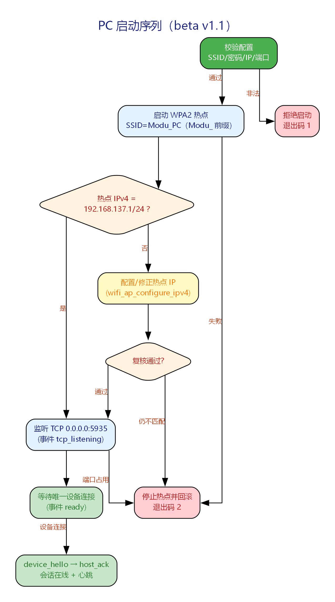
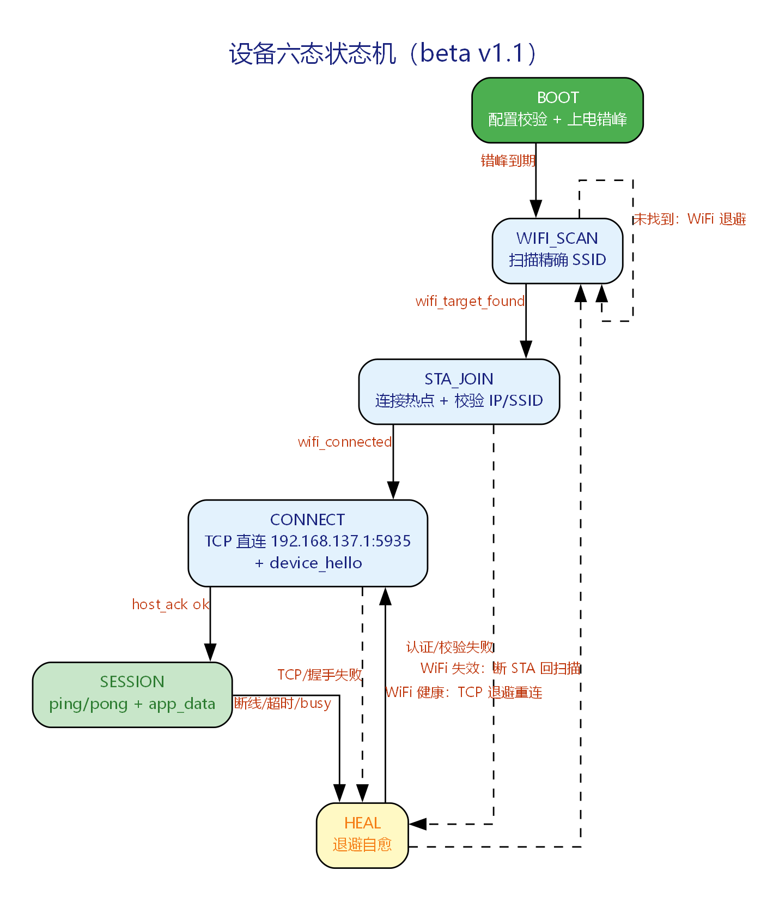

# ModuTech 设备直连通信流程（beta v1.1）

当前版本：**beta v1.1（简化版）**。一对一固定拓扑：Windows PC 主动创建 WPA2 热点，
Linux 设备扫描并连接热点后直连固定地址 `192.168.137.1:5935`，完成握手、心跳与应用数据通信。
本版明确**删除**旧版（v1.0 及更早）的设备 SoftAP 配网、PIN 认证、WiFi 凭据下发、
mDNS/组播服务发现与多设备并发管理。

旧版复杂流程文档已归档：`archived/流程文档归档/`；本版的开发过程文档见
`Document/Update/beta v1.1/`（需求说明、设计文档、问题清单、验收文档）。

## 1. 文档信息

### 1.1 版本沿革

| 版本 | 日期 | 内容 |
|------|------|------|
| v0 | 2026-07-29 | 四阶段最小模型（启动判断 / 配网 / 组播发现 / 异常重连） |
| v1 ~ v3 | 2026-08-03 | 五阶段复杂流程：SoftAP 配网（PIN 认证）→ 三级服务发现 → TCP 会话 → 自愈，叠加安全 / 可观测 / 传输健壮性增强（已归档） |
| beta v1.0.x | 2026-08-04 ~ 08-06 | C++ Demo 开发与修复（配网到通信打通、代码拆分、交付文档） |
| **beta v1.1（本版）** | 2026-08-19 | **流程简化**：一对一 PC 热点直连，裁剪全部配网 / 发现 / 多设备业务 |
| **beta v1.2（wire v2）** | 2026-08-20 | 数据面改为不透明二进制串口字节流透传（`CONTROL_JSON` + `SERIAL_BYTES`），`serial_profile` 随 `device_hello` 下发 |

### 1.2 环境假设

面向**工厂局域网离线场景**：PC 热点、TCP 连接、心跳保活、异常自愈全部在局域网内完成，
不依赖互联网。每台 PC 同时只服务**一台**设备。

## 2. 流程总览

### 2.1 角色与拓扑

| 角色 | 说明 |
|------|------|
| **上位机（Windows PC）** | 主动创建 WPA2 移动热点、保证热点网卡固定 IP、运行 TCP 服务器、管理唯一设备会话 |
| **设备（Linux）** | 纯 STA：扫描并连接 PC 热点、直连固定地址、发起握手、心跳与应用数据 |

```text
Windows PC（Windows 10/11）
  1. 校验配置（fail-closed）
  2. 创建 SSID=Modu_PC（可配置，必须 Modu_ 前缀）的 WPA2 热点
  3. 校验/配置热点 IPv4 = 192.168.137.1/24
  4. 监听 0.0.0.0:5935，等待唯一 Linux 设备连接

Linux Device
  1. 扫描 WiFi，查找精确 SSID（pc_ap_ssid，默认 Modu_PC）
  2. 用固定密码 modu_leventure 连接，获取 DHCP IPv4 并复核 SSID
  3. 直连 192.168.137.1:5935，device_hello → host_ack
  4. ping/pong 心跳 + 二进制串口字节流（`SERIAL_BYTES`）；WiFi/TCP 失败退避重试
```

### 2.2 相对 v1.0 的关键变化

| 维度 | v1.0（复杂版） | v1.1（本版） |
|------|---------------|-------------|
| 热点方向 | 设备开 SoftAP 热点，PC 临时连接 | **PC 主动开热点，设备纯 STA 连接** |
| 配网 | PIN 会话认证 + wifi_config 下发 + 确认回滚 | **全部删除**（密码为固定产品常量） |
| 服务发现 | mDNS → UDP 组播 → 候选列表三级发现 | **全部删除**（地址固定 192.168.137.1:5935） |
| 设备数量 | 多设备并发（上限 16） | **一对一**（上限 1，超限 busy 拒绝） |
| 目标芯片 | ESP32-C2 | **不在本版开发与验收范围**（保留移植骨架） |
| 会话能力 | 握手 / 心跳 / 诊断查询 | 握手 / 心跳 / 应用数据（5 条命令） |

完整裁剪对照见附录 A；裁剪决策过程见 `流程审核与重设计说明.md`。

## 3. 跨端常量与配置

### 3.1 冻结常量（两端 `protocol.h` 一致）

| 名称 | 值 | 说明 |
|------|---:|------|
| `PROTO_VERSION` | `1` | 协议版本 |
| `PROTO_TCP_PORT` | `5935` | PC TCP 服务端口 |
| `PROTO_PC_AP_IP` | `192.168.137.1` | 设备固定连接地址 |
| `PROTO_PC_AP_PREFIX` | `Modu_` | 热点 SSID 必须前缀 |
| `PROTO_PC_AP_DEFAULT_SSID` | `Modu_PC` | 默认热点名 |
| `PROTO_PC_AP_PASSWORD` | `modu_leventure` | 固定 WPA2 密码 |
| `PROTO_HOST_MAX_CONN` | `1` | 一对一连接上限 |
| `PROTO_MSG_MAX_LEN` | `1024` | JSON 最大负载（字节） |
| `PROTO_FRAME_HEAD_LEN` | `2` | 帧长度前缀字节数 |
| `APP_DATA_TEXT_MAX` | `512` | 应用文本最大 UTF-8 字节数 |
| `PROTO_SESSION_ID_LEN` | `8` | session_id 长度 |
| `PROTO_WIRE_VERSION` | `2` | wire 线格式版本（数据面二进制） |
| `PROTO_V2_HEAD_LEN` | `4` | v2 外层长度前缀字节数 |
| `PROTO_V2_BODY_HEAD_LEN` | `12` | v2 体头（type+flags+reserved+sequence）字节数 |
| `PROTO_V2_FRAME_MAX_LEN` | `65536` | 单帧 total_length 上限 |
| `PROTO_V2_CONTROL_MAX_LEN` | `4096` | 控制 JSON payload 上限 |
| `PROTO_V2_SERIAL_CHUNK_MAX` | `16384` | 串口二进制 chunk 上限 |

### 3.2 配置校验

两端各自提供 `params_validate` / `device_config_validate`，启动时先校验，非法即退出（退出码 1）：

- SSID 长度 6~32 字节、以 `Modu_` 开头、后缀仅 `[A-Za-z0-9_-]`；
- 密码精确等于 `modu_leventure`；IP 精确等于 `192.168.137.1`；前缀长度精确 24；端口精确 5935；
- 各超时为正数；设备 `wifi_retry_max >= 1` 且退避上下限合法。

PC 端关键配置字段（`demo/pc/config/pc_config.json`）：

```json
{
  "host_tcp_port": 5935, "pc_ap_ssid": "Modu_PC",
  "pc_ap_password": "modu_leventure", "pc_ap_ip": "192.168.137.1",
  "pc_ap_prefix_length": 24,
  "heartbeat_interval_ms": 10000, "heartbeat_dead_ms": 0,
  "hello_timeout_ms": 5000, "malformed_max_per_conn": 3,
  "device_rate_limit_per_sec": 50
}
```

设备端关键配置字段（`demo/device/config/device_sim.json`）：在上述基础上增加
`power_on_jitter_max_ms`、`wifi_retry_max`、`wifi_backoff_*`、`busy_backoff_ms`、
`reconnect_backoff_*`、`pc_host_ip`、`nvs_dir`、`use_real_wifi_sta`（sim=0 / linux=1）、
`device_fw_version`、`device_proto_ver` 等。完整字段与语义见
`Document/Update/beta v1.1/设计文档.md` 第 6 节。

## 4. PC 端流程

### 4.1 启动序列（含回滚）



*图 Fig101：PC 启动序列。校验配置 → 启动热点 → 固定 IP 校验/配置 → TCP 监听 → 等待设备；任一步失败按逆序回滚。*

1. **配置校验**：非法配置 → 退出码 1，不创建任何资源。
2. **启动热点**：`wifi_ap_start(ssid, password, NULL)`（Windows 后端走现代移动热点 WinRT，
   不回退 `netsh hostednetwork`）。失败 → 退出码 2，清理已创建资源。
3. **固定 IP**：查询热点状态（`wifi_ap_status`），IPv4 不是 `192.168.137.1/24` 时调用
   `wifi_ap_configure_ipv4` 修正并复核；仍不匹配 → 停止热点、退出码 2。
4. **TCP 监听**：监听 `0.0.0.0:5935`（`host_tcp_port`）。端口占用 → 停止热点、退出码 2。
5. **等待设备**：产生结构化事件 `hotspot_ready`（含 ssid/ip/prefix_length，**不含密码**）
   → `tcp_listening` → `ready`。

> 不允许“TCP 已监听但热点未就绪”或“热点已创建但固定 IP 未配置成功”的中间态存在。

**停止顺序**（`request_stop` / 析构，幂等）：停止接收新连接 → 关闭在线/待握手连接 →
关闭 TCP listener → 停止热点 → sim 后端删除 catalog / Windows 后端释放系统资源。

### 4.2 一对一连接管理

- listener 可接受待握手连接，但“在线设备 + pending”总数不得超过 1；
  超限回复 `host_ack busy reason=single_device_only` 后关闭，不影响已有设备。
- 同一设备 ID 重连：旧连接已离线 → 允许恢复；旧连接仍在线 → 按 busy 拒绝，不替换旧连接。
- 心跳判死：`heartbeat_dead_ms`（默认 0 = 按心跳间隔自动推导）内无任何报文 → 判定离线、
  关闭连接、产生 `session_offline`，等待设备重连。

## 5. 设备端流程（六态状态机）

### 5.1 状态定义

```c
typedef enum {
    DEV_STATE_BOOT = 0,      /* 上电与配置校验 */
    DEV_STATE_WIFI_SCAN,     /* 扫描目标热点 */
    DEV_STATE_STA_JOIN,      /* STA 连接热点 */
    DEV_STATE_CONNECT,       /* TCP 连接 + 握手 */
    DEV_STATE_SESSION,       /* 会话在线（心跳/应用数据） */
    DEV_STATE_HEAL,          /* 异常自愈（退避重试） */
    DEV_STATE_COUNT
} device_state_t;
```



*图 Fig102：设备六态状态机。BOOT → WIFI_SCAN → STA_JOIN → CONNECT → SESSION，异常进入 HEAL 后按 WiFi 健康状况回 CONNECT 或 WIFI_SCAN。*

### 5.2 状态转移与行为

| 状态 | 行为 | 转移条件（事件） |
|------|------|-----------------|
| `BOOT` | 校验配置；上电错峰（`power_on_jitter_max_ms` 随机延迟，防同步风暴） | 到期 → `WIFI_SCAN` |
| `WIFI_SCAN` | 调用 `net_wifi_scan`，只接受与 `pc_ap_ssid` **精确相等**且 `band_2g=1` 的记录 | 找到 → `wifi_target_found` → `STA_JOIN`；未找到 → 按 WiFi 退避留在本状态 |
| `STA_JOIN` | `net_wifi_sta_connect(ssid, password)`；成功后必须 `wifi_get_ip != 0` 且 `wifi_get_current_ssid` 精确匹配 | 成功 → `wifi_connected` → `CONNECT`；失败 → `wifi_connect_failed(reason)` → `HEAL` |
| `CONNECT` | TCP 连接固定 `pc_host_ip:host_tcp_port`（`192.168.137.1:5935`），发送 `device_hello` | `host_ack ok` → `SESSION`；TCP/握手失败 → `HEAL` |
| `SESSION` | 心跳 `ping/pong` + 双向 `app_data`；收到 `busy` 置长退避 | 断线/超时/busy → `HEAL` |
| `HEAL` | 见 5.3 | 见 5.3 |

### 5.3 异常自愈（HEAL）

- **WiFi 健康**（当前 SSID/IP 仍有效）：按 TCP 退避（`reconnect_backoff_base_ms` 指数退避 +
  抖动，上限 `reconnect_backoff_cap_ms`）回 `CONNECT`，重发 `device_hello`（可携带上次
  `session_id` 续接）。
- **WiFi 失效**：断开 STA，按 WiFi 退避（`wifi_backoff_base_ms`/`cap_ms`/`jitter_ms`，
  重试上限 `wifi_retry_max`）回 `WIFI_SCAN`。
- **busy 拒绝**：按 `busy_backoff_ms`（默认 6000ms）长退避后重试，避免反复敲门。
- **WiFi 错误分类**（`wifi_reason_t`）：`202 AUTH_FAIL`（密码错误）与 `201 NO_AP_FOUND` /
  `205 HANDSHAKE_TIMEOUT`（可恢复）分别记录 reason；v1.1 不再进入任何设备 AP / 配网模式。
- 设备**不创建热点、不参与服务发现、不发送 UDP 组播**（旧模块已从业务与构建图中移除）。

### 5.4 心跳与应用数据

- 设备每 `heartbeat_interval_ms`（sim 配置默认 2000ms）发送 `{"cmd":"ping","seq":N}`，
  PC 回复 `{"cmd":"pong","seq":N}`（序号必须回显）。
- 双方在判死时间内未收到任何报文 → 判连接失效，进入 HEAL / 清理连接。
- 业务数据为不透明串口字节流（`SERIAL_BYTES`），由 `device_host_send_serial_bytes` 提交，
  单 chunk 上限 `PROTO_V2_SERIAL_CHUNK_MAX=16384`，PC 原样回调 `IHostDataSink::OnSerialBytes`；
  不在网络层解析传感器协议，串口帧边界由上位机串口解码管道恢复。
- `app_data`（`seq + data.type + data.text`）仅保留为 PC demo 调试消息，文本上限
  `APP_DATA_TEXT_MAX=512` 字节（UTF-8），不是生产数据面。

## 6. 协议

### 6.1 帧（wire v2）

所有 TCP 消息使用统一外层 framing：

```text
[total_length u32 BE][frame_type u8][flags u8][reserved u16][sequence u64 BE][payload N]
```

- `total_length`：从 `frame_type` 到 payload 末尾的字节数，不含自身 4 字节；最小 12、最大
  `PROTO_V2_FRAME_MAX_LEN=65536`。
- `frame_type`：`1=CONTROL_JSON`、`2=SERIAL_BYTES`。
- `flags` / `reserved` 必须为 0；`sequence` 每方向每 TCP session 从 1 严格递增。
- 解析器读满 4 字节长度前不分配 payload；非法长度/type/flags/reserved 立即关闭连接并记录
  `protocol_length_invalid`，不在二进制 payload 内扫描重同步。
- 发送统一走单一 writer 状态机（Idle → HaveFrame → PartialWrite → Completed），任何帧只有
  `offset == encoded_size` 才算发送成功；`EAGAIN` 保留 offset 续传，`send=0`/fatal 关闭连接。
- 队列：控制容量 32、数据容量 256、数据总字节 ≤ 4 MiB；控制优先但每 8 个控制帧后必须发 1 个
  数据帧防饿死；数据满拒绝新 chunk 返回 `BUSY`，不丢旧、不拆包。

### 6.2 命令（共 5 条）

| 方向 | 命令 | 说明 |
|------|------|------|
| 设备 → PC | `device_hello` | 注册握手（必需 `id/fw_version/proto_ver/uptime` + `serial_profile`，`session_id` 可选） |
| PC → 设备 | `host_ack` | 确认（`ok` / `busy` / `fail`） |
| 设备 → PC | `ping` | 心跳（`seq` 单调递增） |
| PC → 设备 | `pong` | 心跳应答（回显 `seq`） |
| 双向 | `error` | 控制面错误（生产命令表；`app_data` 仅保留为 PC demo 调试消息） |

`device_hello` 必须携带 `serial_profile`：

```json
{
  "frame_size": 3172, "rows": 36, "cols": 44, "data_points": 1584,
  "value_domain": "raw_adc"
}
```

约束：`frame_size >= 6`、`rows * cols == data_points`、`frame_size == 4 + data_points * 2`、
`value_domain` 仅 `raw_adc`。违反则 `host_ack fail reason=invalid_serial_profile` 并断开。

### 6.3 报文示例

```json
{"cmd":"device_hello","id":"02:00:00:00:00:01","fw_version":"1.1.0","proto_ver":2,"uptime":10,"session_id":"a1b2c3d4","serial_profile":{"frame_size":16,"rows":2,"cols":3,"data_points":6,"value_domain":"raw_adc"}}
{"cmd":"host_ack","status":"ok","heartbeat_interval":10,"session_id":"a1b2c3d4","proto_ver":2}
{"cmd":"host_ack","status":"busy","reason":"single_device_only"}
{"cmd":"host_ack","status":"fail","reason":"unsupported_protocol"}
{"cmd":"ping","seq":1}
{"cmd":"pong","seq":1}
```

`session_id` 首次连接可省略；断线重连时携带，PC 用于区分“全新注册”与“续接重连”。
`proto_ver` 必须等于 `PROTO_WIRE_VERSION=2`，否则 PC 回复 `fail/unsupported_protocol` 并关闭。

### 6.4 协议契约（protocol-contract schema 3）

PC 与设备各自生成 `share/protocol-contract.json`，集成测试与
`demo/integration_tests/contracts/protocol-contract.golden.json` 强制语义一致：

```json
{
  "schema_version": 3, "protocol_version": 1, "wire_version": 2,
  "frame": {"head_bytes": 4, "body_bytes": 12, "byte_order": "big",
            "max_total_length": 65536, "sequence_bytes": 8,
            "types": {"control_json": 1, "serial_bytes": 2}},
  "tcp": {"host_ip": "192.168.137.1", "port": 5935, "max_connections": 1},
  "wifi": {"ssid_prefix": "Modu_", "default_ssid": "Modu_PC",
           "password": "modu_leventure", "prefix_length": 24},
  "limits": {"control_json_bytes": 4096, "serial_chunk_bytes": 16384,
             "app_data_text_bytes": 512, "session_id_length": 8},
  "commands": ["device_hello", "host_ack", "ping", "pong", "error"],
  "serial_profile": {"required_fields": ["frame_size", "rows", "cols", "data_points", "value_domain"],
                     "value_domain": ["raw_adc"]},
  "device_states": {"boot": 0, "wifi_scan": 1, "sta_join": 2,
                    "connect": 3, "session": 4, "heal": 5, "count": 6}
}
```

## 7. 后端与模拟联调

| 端 | 后端 | 说明 |
|----|------|------|
| PC | `windows` | 真实后端：现代移动热点 WinRT + 固定 IP 配置 + TCP 监听；失败 fail-closed 不回退 sim |
| PC | `sim` | 发布 `<sim-catalog-dir>/pc-hotspot.json`（schema 2）虚拟热点，供双进程联调 |
| 设备 | `sim` | 读取 PC catalog 模拟扫描/STA，并把 `192.168.137.1:5935` 翻译到 loopback |
| 设备 | `linux` | 真实后端：nmcli 纯 STA + TCP 客户端；**不要求 root**（不再创建 hostapd/dnsmasq 热点） |
| 设备 | `esp32c2` | ESP-IDF 移植骨架；**beta v1.1 不纳入开发与验收** |

sim catalog schema 2（`pc-hotspot.json`）：`schema/ssid/password/logical_gateway/prefix_length/
tcp_port/loopback_host/loopback_port/owner_pid/published_at_ms`。PC 原子写入并在停止时删除；
设备只读，记录超过 30 秒且 owner 进程不存活即失效（fail-closed）。

双进程联调（无需真实网卡）：

```powershell
# 终端 1：PC（sim 后端）——先启动并等待其发布 catalog
$env:QT_QPA_PLATFORM="offscreen"
out\pc-build\bin\Debug\provision_pc.exe --backend sim `
  --config demo\pc\config\pc_config.json --sim-catalog-dir out\cat `
  --events-jsonl out\pc-events.jsonl --duration 60

# 终端 2：设备（sim 后端，同一 sim-catalog-dir）
out\device-build\bin\Debug\provision_device.exe --backend sim `
  --config demo\device\config\device_sim.json --device-index 0 --fresh `
  --sim-catalog-dir out\cat --events-jsonl out\dev-events.jsonl --duration 60
```

## 8. 结构化事件（验收证据）

两端以 `--events-jsonl` 每行输出一个 JSON 事件，是集成测试唯一的机器可读证据。

- **PC**：`hotspot_ready`、`hotspot_error`（不含密码）、`tcp_listening`、`ready`、
  `session_online` / `session_offline`、`single_device_rejected`、
  `ping` / `pong`、`app_data_tx` / `app_data_rx`、`shutdown_complete`。
- **设备**：`wifi_scan_started`、`wifi_target_found`（SSID/RSSI）、`wifi_connected`（不含密码）、
  `wifi_connect_failed`（reason）、`tcp_connecting`、`session_online` / `session_offline`、
  `ping` / `pong`、`app_data_*`、`scenario_result`（仅 sim 场景）、`shutdown_complete`。

正常会话的事件顺序：设备 `wifi_scan_started → wifi_target_found → wifi_connected →
tcp_connecting → session_online`；PC 启动顺序 `hotspot_ready → tcp_listening → ready`。

## 9. 测试与验收状态（beta v1.1）

| 测试类型 | 用例数 | 状态 |
|----------|--------|------|
| PC 单元 / UI / 契约测试 | 135 unit + UI + contract | 通过（wire v2 frame / contract / session / partial write） |
| 设备单元 / 组件测试 | 154 | 通过（runtime/config/core/sim/linux/esp32/ui） |
| 跨端集成测试（sim 双进程，场景 A~H） | 8 场景 | beta v1.1 通过；wire v2 高频/背压集成属 v2.2-pre.1 Stage D1，待主仓库适配后执行 |
| Windows 真实热点 | — | 部分验证 + **阻塞**：WinRT 热点启动已实测成功；固定 IP `192.168.137.1/24` 改写需管理员权限（阶段三问题清单 CQ7） |
| Linux 真实设备 | — | **阻塞**：本机为 Windows 开发机，无 nmcli/无线网卡/Linux 环境（阶段三问题清单 CQ4） |

真实环境验收需专用硬件环境；sim 自动化不能替代真实环境结论，当前按规范记录为阻塞项。
集成测试证据见 `out/v11-integration-evidence-final/`，验收标准见
`Document/Update/beta v1.1/验收文档.md`。

## 10. 附录

### 附录 A：v1.0 → v1.1 裁剪对照

| v1.0（复杂版）元素 | v1.1 处理 |
|--------------------|-----------|
| 设备 SoftAP 热点、PIN 会话认证、`auth`/`auth_result` | 删除 |
| `wifi_config` / `wifi_result` 凭据下发、确认窗口、NVS 回滚 | 删除 |
| `close_ap`、热点超时退避 | 删除 |
| mDNS / UDP 组播 `host_announce` / `host_bye`、候选地址列表 | 删除（组件文件保留不编译或已物理删除） |
| 多设备注册表、连接数 16、容量统计 | 改为一对一（上限 1，busy 拒绝） |
| `diag_query` / `diag_report`、事件日志环形缓冲 | 删除（保留本地日志文件） |
| 七态状态机 `AP_PROVISION` / `DISCOVERY` | 改为六态（`BOOT/WIFI_SCAN/STA_JOIN/CONNECT/SESSION/HEAL`） |
| `device_hello` 的 `type` / `capabilities`、`host_ack` 的 `server_time` / `fw_min_req` | 删除 |
| ESP32-C2 开发与验收 | 移出版本范围（保留 `backends/esp32c2` 与 `firmware/esp32c2` 骨架） |
| 设备端创建热点（hostapd/dnsmasq，需 root） | Linux 后端改为纯 STA，普通用户可运行 |

### 附录 B：历史文档索引

- 旧版流程（v0~v3 复杂版）：`archived/流程文档归档/流程说明_v1.0(v3增强版)_归档.md`
- 旧版审核记录：`archived/流程文档归档/流程审核与重设计说明_v1.0(v1~v3)_归档.md`
- 简化决策与本版裁剪说明：`流程审核与重设计说明.md`
- 本版开发过程：`Document/Update/beta v1.1/`（需求 / 问题清单 / 设计 / 开发文档 / 验收）
- 历史交付件（v1.0.6 移植说明四件套）：`Document/移植说明/`
- 版本沿革与迭代记录：`历史主线.md`
